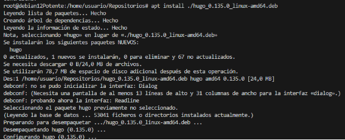
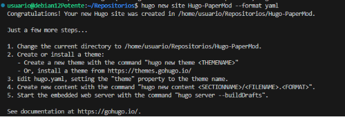
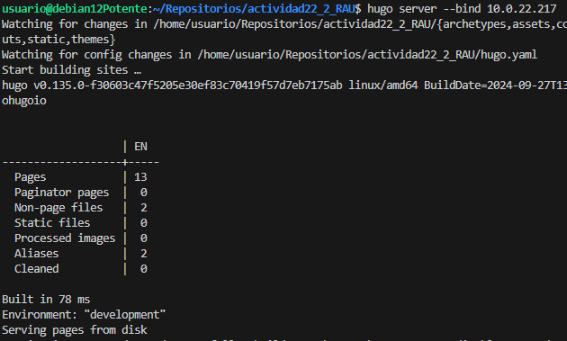
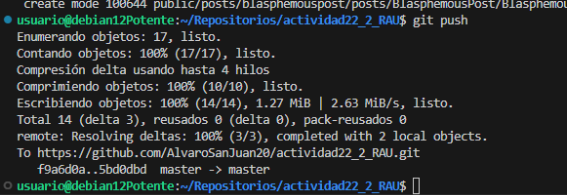
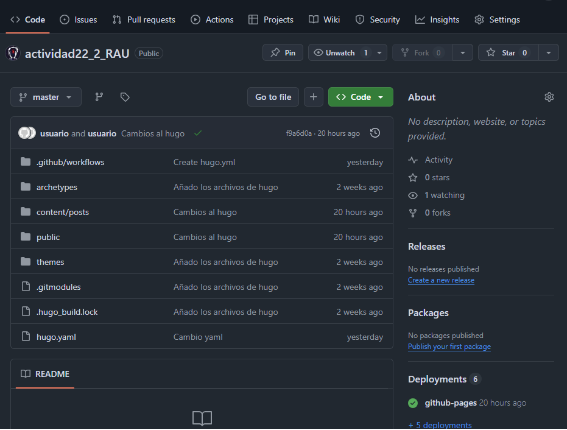
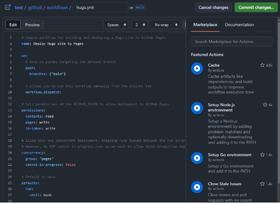
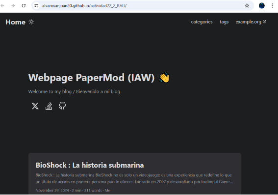
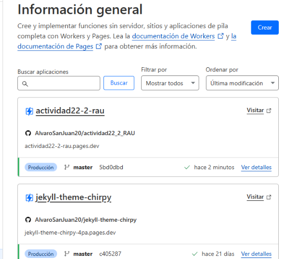
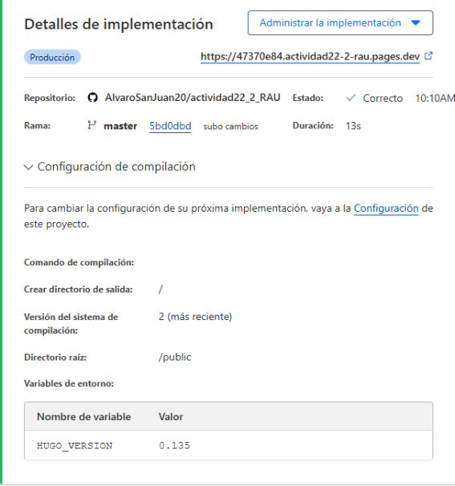
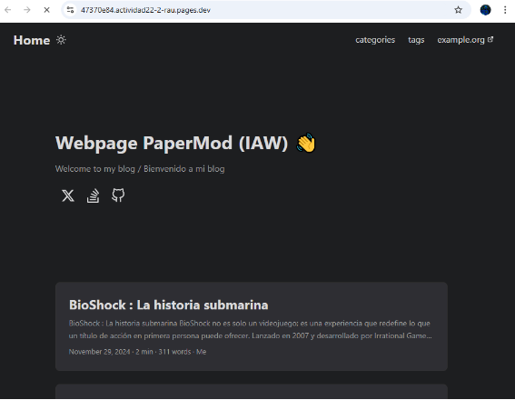

# Tarea 2: Creación del repositorio de Hugo Papermod
`por Alvaro San Juan - ASIR2`

En esta actividad vamos a crear una nueva página web que use Hugo como base para funcionar y que use el estilo de Papermod

## Preparación de Hugo

> Para poder hacer el repositorio usando hugo tendremos que instalar hugo, para ello tenemos que ir al GitHub de Hugo, entrar en versiones y luego ir a la página 2 para encontrar la v0.135

> Elegimos el archivo de Linux AMD64.deb y copiamos su enlace, con el enlace copiado vamos a ir a VS code conectado en remoto de Debian dentro del fichero "repositorios". Usaremos en el terminal wget (Link) para instalar el archivo.

> Ahora que tenemos el archivo vamos a ir al root (solo necesario para instalar) y hacemos apt install del archivo hugo v0.135.

## Creación del repositorio Papermod

> Ahora que tenemos todo instalado revisaremos el GitHub en la Wiki, en la sección de instalación. En esta sección tendremos una guía de como instalar el Papermod.

> Primero crearemos el nuevo sitio Hugo con hugo new site (Nombre), es opcional pero no recomendado usar --format yaml para el sitio. Papermod lo recomienda por lo que vamos a usarlo.

> Entraremos en el nuevo fichero con cd y luego usaremos git submodule add como se pide en el metodo 2 recomendado por Papermod. Al hacer esto nos dirá que el directorio no es un repositorio.

> Usaremos git init para transformar el directorio en un repositorio.

> Ahora sí usaremos submodule add y despues los git submodules update / git submodule init.

> Dentro del repositorio crearemos una carpeta llamada posts dentro de content, dentro de content/posts crearemos carpetas para los posts, y dentro de estas carpetas pondremos los nuevos posts.

> Estructura: content/posts/postname/post.md

> Es importante indicar que se debe usar  la estructura de yaml que se indica en la página web de Papermod, dentro del hugo.yaml. 

> Ahora que está configurado todo tendremos que usar el comando de hugo server --bind (IP) para que hugo nos creé la página web con su propio servidor localhost.

> Este es el aspecto: 

## Papermod en GitHub

> Como ya está creado la página web tendremos que subirlo a GitHub, para subirlo tendremos que crear un repositorio en GitHub con el mismo nombre del repositorio en VS code. En el terminal pondremos git add y git commit, también git remote origin (Link del repositorio) y git push.

> Este es el resultado final en GitHub (ignora el workflow)

> Ahora toca crear la página web en GitHub, para ello tenemos que poner como source el GitHub Actions.

> Buscaremos en GitHub todos los posibles workflows disponibles, entre estos tenemos que buscar Hugo.

> Al presionar configure nos mostrará un modelo de Workflows especializado en Hugo, lo crearemos y se añadirá directamente al repositorio. (ES IMPORTANTE HACER UN GIT PULL DESPUES DE CREAR EL WORKFLOW O ESTARÁN DESINCRONIZARÁ)

> Como podemos ver funciona la página web.

## Despliegue en CloudFlare

> Crearemos una página en Work & Pages (ES IMPORTANTE AÑADIR EL REPOSITORIO EN CLOUDFLARE), seleccionando el repositorio y poniendo la configuración necesaria.

> Ponemos como modulo el de Hugo, quitamos la instalación de Hugo y pondremos que /public sea la carpeta raiz. Ademas vamos a crear una variable que sea HUGO_VERSION 0.135.

> La página ya ha sido creada y funciona.

